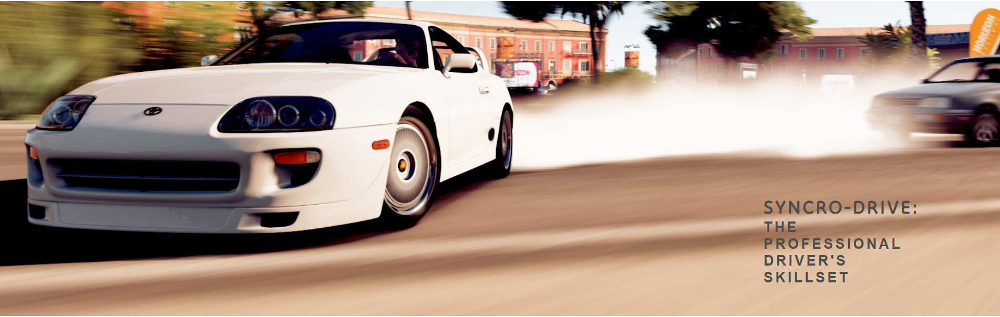
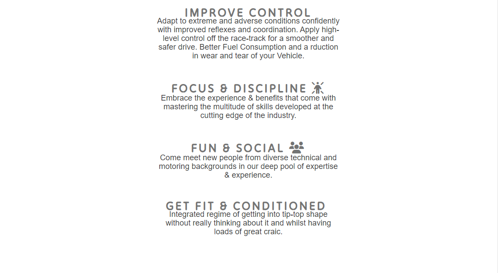
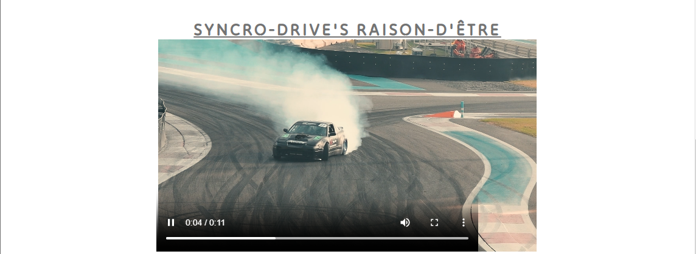
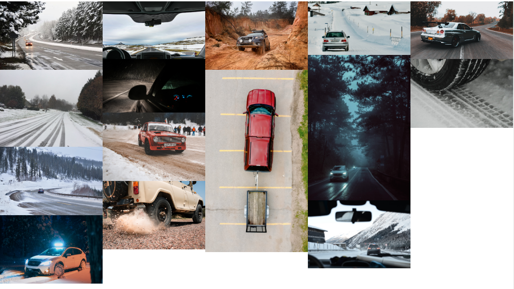
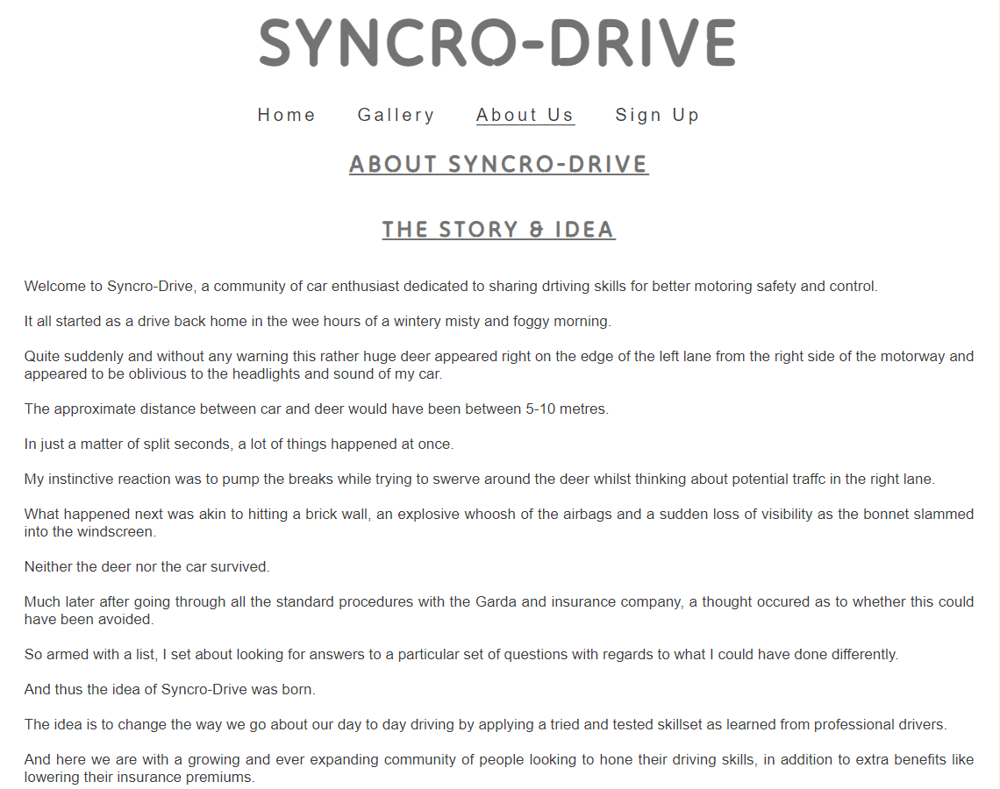
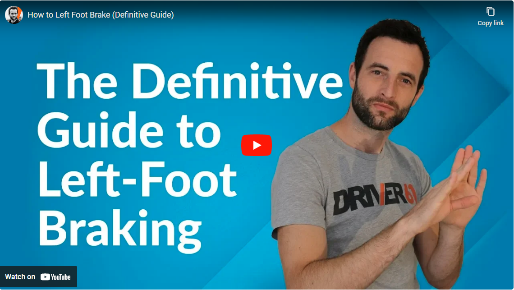
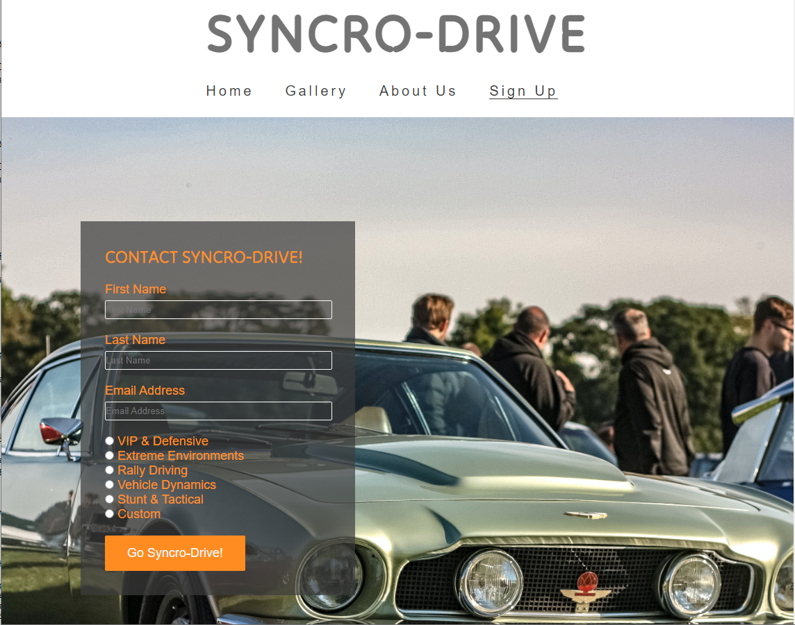

# Syncro-Drive

Syncro-Drive is live @ [Synco-Drive!](https://impisq.github.io/syncr0-drive/)

## Tabel of Contents
+ [UX](#ux "UX")
  + [Site Purpose](#site-purpose "Site Purpose")
  + [Site Goal](#site-goal "Site Goal")
+ [Design](#design "Design")
  + [Colour Scheme](#colour-scheme "Colour Scheme")
  + [Typography](#typography "Typography")
  + [Imagery](#imagery "Imagery")
+ [Features](#features "Features")
  + [Existing Features](#existing-features "Existing Features")
+ [Testing](#testing "Testing")
  + [Validator Testing](#validator-testing "Validator Testing")
  + [Unfixed Bugs](#unfixed-bugs "Unfixed Bugs")
+ [Technologies Used](#technologies-used "Technologies Used")
  + [Main Languages Used](#main-languages-used "Main Languages Used")
  + [Frameworks, Libraries & Programs Used](#frameworks-libraries-programs-used "Frameworks, Libraries & Programs Used")
+ [Deployment](#deployment "Deployment")
+ [Credits](#credits "Credits")
  + [Content](#content "Content")
  + [Media](#media "Media")

##  UX
_____________________________________________________________________

### Site Purpose:
This is the introductory website to Syncro-Drive.
The concept of creating a community of enthusiasts for safer, better, faster more responsive driving skills is at the heart of Syncro-Drive. 

The inspiration for Syncro-Drive came from a combination of different frustrations with motoring in Ireland.
Among these are high and exorbitant insurance premiums, with very limited options on the market.
Driving school lessons are less than adequate when compared to most European standards and thus a lot of bad drivers on the road.
We shall not even talk about inconsistent speed limits.
And so came the idea of creating a legaly recognised skill-set that might be able to address some of these frustrations whilst building a community and space for enthusiasts.

### Site Goal:
Our site has been set up to provide an option for signing up for a particular skill-set of their choice with industry professionals running the training, whilst retaining an element of a fun and social community.

## Design

### Colour Scheme
The two main colours used are White and Orange.

### Typography
The Tilt Neon font is the font used for headings on all pages 4 website pages whilst paragraphs and text use Lato with Sans Serif as the fallback font in case for any reason the font isn't being imported into the site correctly. 

## Features 
### Existing Features

  - Identically featured on all four pages, the fully responsive navigation bar includes links to the Logo, Home page, Gallery, About Us and Sign Up pages for smoothe and seamless navigation.
  - The navigation bar enables the visitor to easily navigate from page to page across all devices without having to revert back to the previous page via the ‘back’ button. 

  

### The landing page image

  - The landing page comprises a photograph with text overlay invitingly declaring the site's purpose and concept. 
  - This section welcomes the visitor to Syncro-Drive with an animated image of a sports car drifting on a street.

### Syncro Ethos Section

  - The Syncro-Ethos section outlines the benefits of signing up for Syncro-Drive meets, sessions, and social events as well as the benefits of learning new driving skills. 
  - This user will see the value of signing up for the Syncro-Drive courses.  

### Central Section
 - This is presented as the purpose and reason to be for Syncro-Drive with an embedded video of a car being skillfuly drifted on a track circuit.

 

### Classes Section
The classes section outlines the various Syncro-Driving Courses from which one can chose their preferred discipline.

### The Footer

  - The footer section is comprised of social media links for everything Syncro-Drive. The links open in a new tab for flexible easy navigation. 
  - This footer is invaluable as mnost updates and information are shared via social media.

  

  ### Gallery

  - The gallery is setup to depict the various driving conditions that most people might find challenging and attempts to show what can be learned when one signs up. 
  - This section is indispensable as this is where visitors get a better insight about the kind of skills being emphasised whilst being able to relate and identify with the various scenarios of adverse driving conditions. 

  

  ### About Us Page
  This page was created as background story to narrate the origins of the concept and idea.

  
  

### Media Section
- This section shows an embedded video that has been borrowed from Driver61.com as a trailer for some of the skills that are going to be covered in any of the Courses taken with Syncro-Drive.

### The Sign Up Page

  - This page is set up for signing up to join Syncro-Drive with a set of options for preferred course. The user has the options of selecting VIP & Defensice, Extreme Environments, Rally Driving, Vehiccle Dynamics, Stunt & Tatical or a custom besopke or tailor-made course. The user is required to submit their full name and email address. 
  - The background imagery is styled with an animation.

### Features Left to Implement

- A more diverse set of images to be deployed
- A dedicated video page which allows members to upload videos
- Addition of more Social Media PLatforms

## Testing 
------
### Validator Testing 

- HTML
  - No errors were returned with [W3C Validator](https://validator.w3.org/) Or [Nu HTML Checker](https://validator.w3.org/nu/)

  

  - CSS
  - No errors were returned with [JIgsaw](https://jigsaw.w3.org/css-validator/) Or [Code Beautify](https://codebeautify.org/)

  

  

  

_ _ _ _

## Unfixed Bugs
There is an issue with some of the pages returning a warning on validation.
Trailing slash on void elements has no effect and interacts badly with unquoted attribute values.
It turns out that this is caused by the Prettier Formatter Auto Formating on Save and this automatically adding a trailing slash.
This is going to require and edit and to re-configure Prettier Formatter Settings.
At this stage its showing as info and not an error however I shall be editing this in the near future.

_ _ _ _ _

## Technologies Used
_________________________________________________________________________

### Languages Used

-   [HTML5](https://en.wikipedia.org/wiki/HTML5)
-   [CSS3](https://en.wikipedia.org/wiki/Cascading_Style_Sheets)

### Frameworks, Libraries & Programs Used

[Font Awesome:](https://fontawesome.com/)

[Git](https://git-scm.com/)

[GitHub:](https://github.com/)

[Google Fonts:](https://fonts.google.com/)

[Am I Responsive](https://ui.dev/amiresponsive?url=https://impisq.github.io/syncr0-drive/index.html)

## Credits 
The Syncro-Drive Website design drew inspiration from the Love Running Project and most of the structure of the site has been based on the Love Running Project with the exception of the About Us Page.

I would like to give credit to my Mentor Martina Terlevic, who has been so supportive and very informative.
I would olike to thank the Code Inastitute Student Care Team who have been very patient and supportive especially given the stressful personal circumstances that I have been dealing with that have had a knock on effect on just about everything in my day to day.
A big shout out to Aoife Ní Dhonnchadha and Bethany Norton at Student Care.
I would alos like to give a big thank you to Paul Thomas O’Riordan the Cohort Facilitator

### Content 

- The text and narrative of the Syncro-Drive website is created by the author
- The About Us narrative is borrowed fr4om a personal experience.
- The icons in the footer were taken from [Font Awesome](https://fontawesome.com/)
- Fonts have been taken from [Google Fonts:](https://fonts.google.com/).

### Media

- The photos, images and drift videos used on the Home, Gallery and Sign up page are from [Pexels](https://www.pexels.com/)
- The deer in headlights image used for the About page was taken from [The World Of Deer](https://worlddeer.org/)
- THe embedded YouTube Video on the About Page is Courtesy of [Driver61.com](https://driver61.com/)
